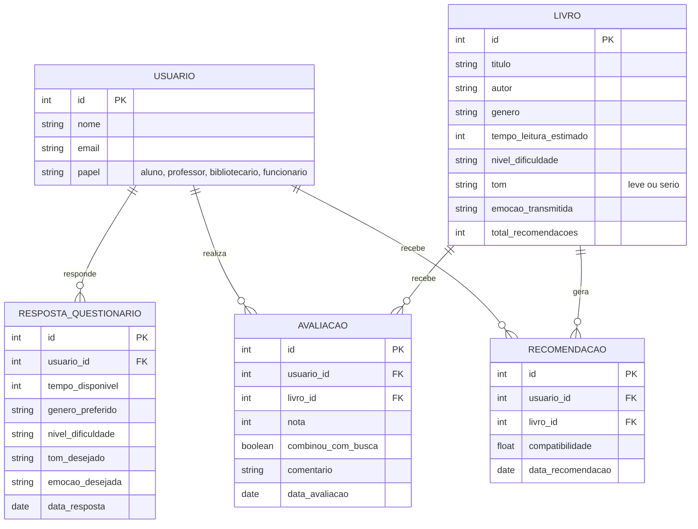

Arquitetura da Solução — LUMI (Sistema Inteligente de Descoberta de Livros)

## 1. Fluxo do sistema

```mermaid
flowchart TD
    A[Usuário] --> B{Login / Cadastro}
    B --> C[Responder questionário de preferências]
    C --> D[Sistema de recomendação]
    D --> E[(Banco de dados de livros)]
    E --> D
    D --> F[Exibir livros recomendados]
    F --> G[Aluno lê o livro]
    G --> H[Avaliar recomendação]
    H --> I[(Banco de dados)]
    I --> J[Atualizar ranking e histórico]
    J --> K[Bibliotecário acompanha interesses da turma]
```

## 2. Arquitetura em camadas

```mermaid
graph LR
    Frontend[Frontend - HTML/CSS/JS] --> API[Backend API - Spring Boot]
    API --> Auth[Módulo de autenticação]
    API --> Livros[Módulo de acervo de livros]
    API --> Quest[Módulo de questionário]
    API --> Rec[Módulo de recomendação]
    API --> Aval[Módulo de avaliação]
    API --> Painel[Módulo do bibliotecário]
    Auth --> DB[(Banco de dados MySQL)]
    Livros --> DB
    Quest --> DB
    Rec --> DB
    Aval --> DB
    Painel --> DB
```

## 3. Modelo de dados (entidades principais)

## 4. Justificativa das escolhas

- **Frontend em HTML, CSS e JavaScript**: garante uma interface leve e acessível, funcionando bem em computadores e dispositivos da biblioteca escolar.
- **Backend em Java com Spring Boot**: fornece uma estrutura robusta e organizada para lidar com as regras de negócio do sistema de recomendação.
- **Módulo de autenticação**: diferencia o acesso entre aluno, professor, bibliotecário e funcionário, protegendo os dados de login.
- **Módulo de acervo de livros**: mantém o cadastro dos livros com suas características (gênero, tempo de leitura, nível de dificuldade, tom, emoção transmitida), permitindo cruzamentos mais específicos do que uma busca por gênero simples.
- **Módulo de questionário**: coleta as preferências do aluno (tempo disponível, humor, tipo de leitura desejada) para alimentar o motor de recomendação.
- **Módulo de recomendação**: cruza as respostas do questionário com as características dos livros cadastrados, calculando a compatibilidade e sugerindo os títulos mais próximos do perfil buscado.
- **Módulo de avaliação**: permite que o aluno avalie se a recomendação combinou com o que procurava, gerando dados que ajudam a refinar futuras recomendações.
- **Módulo do bibliotecário**: oferece um painel para acompanhar os interesses dos alunos, o ranking dos livros mais recomendados e o histórico de recomendações, apoiando decisões de acervo.
- **Banco de dados MySQL**: estrutura relacional adequada para armazenar usuários, livros, respostas, recomendações e avaliações de forma organizada e consultável.
- **Versionamento com Git e GitHub**: garante controle de versões do código e colaboração entre os desenvolvedores do projeto.
- **Link para o Trello** https://trello.com/b/shVJDuF9/lumi
