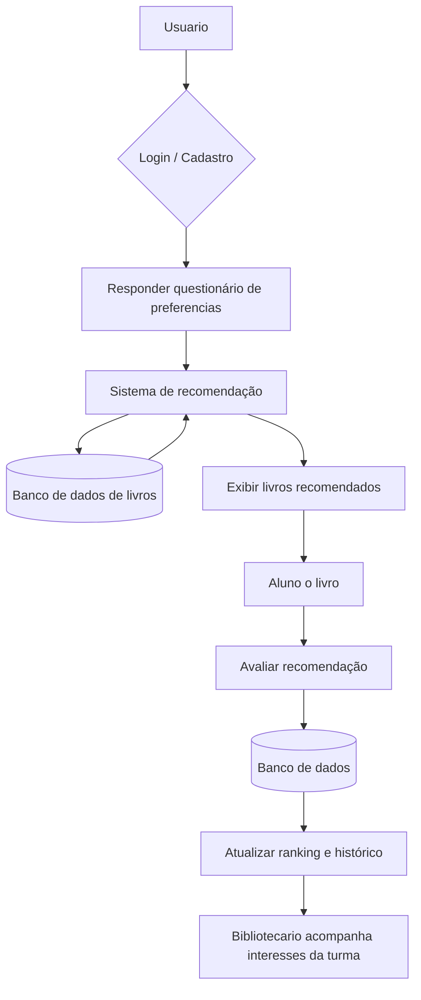
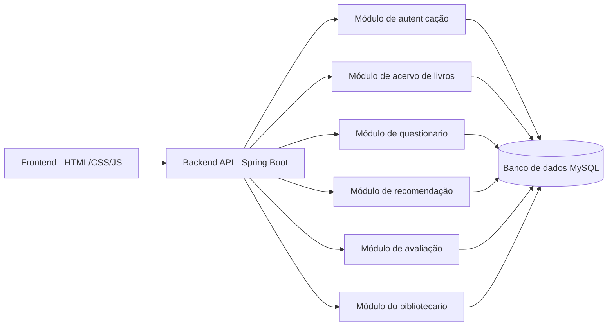
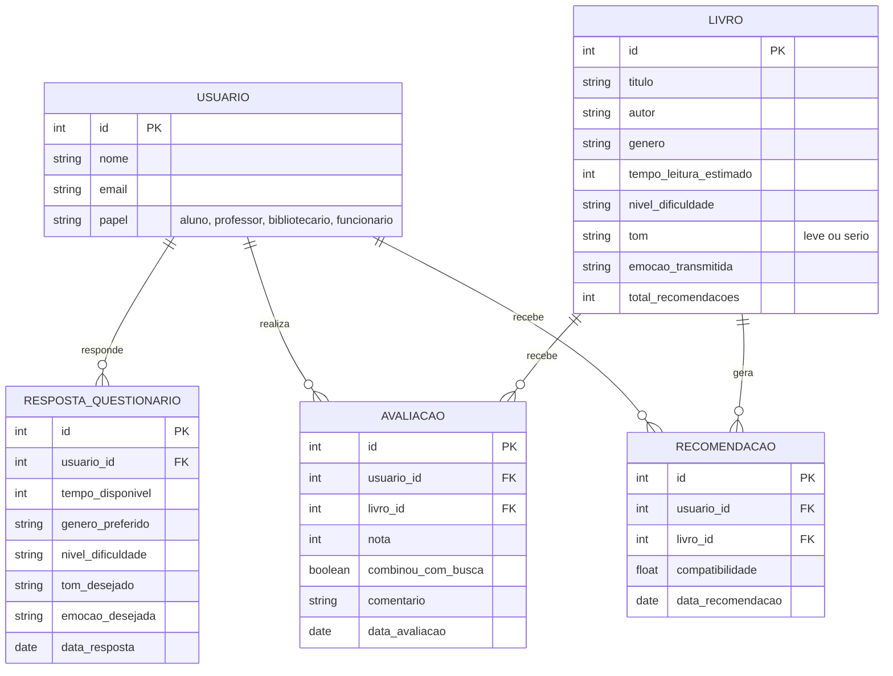

Arquitetura da Solução LUMI (Sistema Inteligente de Descoberta de Livros)

## 1. Fluxo do sistema

## 2. Arquitetura em camadas

## 3. Modelo de dados (entidades principais)

## 4. Justificativa das escolhas

- **Frontend em HTML, CSS e JavaScript**: garante uma interface leve e acessivel, funcionando bem em computadores e dispositivos da biblioteca escolar.
- **Backend em Java com Spring Boot**: fornece uma estrutura robusta e organizada para lidar com as regras de negócio do sistema de recomendação.
- **Módulo de autenticação**: diferencia o acesso entre aluno, professor, bibliotecario e funcionários, protegendo os dados de login.
- **Módulo de acervo de livros**: mantém o cadastro dos livros com suas caracteristicas (gênero, tempo de leitura, nível de dificuldade, tom, emoção transmitida), permitindo cruzamentos mais específicos do que uma busca por gênero simples.
- **Módulo de questionário**: coleta as preferências do aluno (tempo disponível, humor, tipo de leitura desejada) para alimentar o motor de recomendação.
- **Módulo de recomendação**: cruza as respostas do questionário com as características dos livros cadastrados, calculando a compatibilidade e sugerindo os títulos mais próximos do perfil buscado.
- **Módulo de avaliação**: permite que o aluno avalie se a recomendação combinou com o que procurava, gerando dados que ajudam a refinar futuras recomendações.
- **Módulo do bibliotecário**: oferece um painel para acompanhar os interesses dos alunos, o ranking dos livros mais recomendados e o histórico de recomendaçôes, apoiando decisões de acervo.
- **Banco de dados MySQL**: estrutura relacional adequada para armazenar usuários, livros, respostas, recomendações e avaliações de forma organizada e consultavél.
- **Versionamento com Git e GitHub**: garante controle de versões do código e colaborações entre os desenvolvedores do projeto.
- **Link para o Trello** https://trello.com/b/shVJDuF9/lumi
